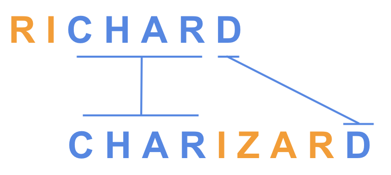

# WordSimilarity
Find the most similar words by surface form (how words appear or how words sound) between given sets of words.

**Bases for similarity:**

* Current version -- English phonetics (heuristic estimation from written form)
* Future versions -- IPA/orthography-based, improved English phonetics-based


## Example
The default file being compared against contains Pokemon names. 

Entering "Richard" as input will result in the output "Charizard".




## Run
*Command line call:*

```WordSim.py TARGET_NAME [--k NUMBER_OF_MATCHES] [--name_file REFERENCE_NAMES_FILE]```

*Arguments:*

* TARGET_NAME is one word (quoted or unquoted) or several words (quoted), the word(s) to be compared to a reference set

* NUMBER_OF_MATCHES is an integer, the number of matches to output (optional, default=1)

* REFERENCE_NAMES_FILE is a filepath, the file containing words to match against (optional, default= file of pokemon names)


*Examples:*

```WordSim.py richard```
    
Gives the best match to "ricardo" from the default file (pokemon names)
    
```WordSim.py Spencer --k 10```
    
Gives the 10 best matches to "spencer"
    
```WordSim.py "greg fletcher" --k 3 --name_file Data/GreekGodNames.txt```
    
Gives the 3 best matches for each name in "greg fletcher" from the given file (greek god names)


## Implementation
Uses a dynamic-time-warping-based approach.

Dynamic time warping compares two series of elements, finding how much one series has to be altered to match the other series (in this case, series of letters or sounds). DTW has been utilized for spell checking and speech recognition.
